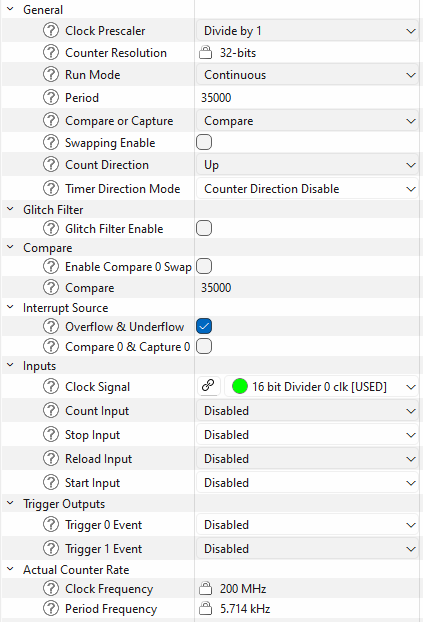
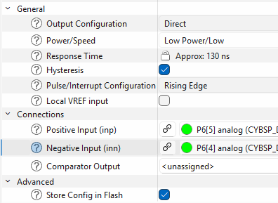

# ModusToolbox™ Safety Test Library (MTB-STL) - IEC 60730 Class B Compliance for Industrial and Home Appliance Safety

# Overview

The ModusToolbox™ Safety Test Library (MTB-STL) provides functional safety APIs to implement overall safety of a system that depends on automatic protection suitable for use in industrial environments and home appliances. STL is created in compliance with IEC 60730 Class B and IEC 61508 SIL 2 standards and is scalable to different MCUs.

# Features

- IEC 60730 Class B and IEC 61508 SIL 2 compliant self-test routines
- CPU register and execution tests
- SRAM and Flash memory tests
- Clock frequency monitoring
- Interrupt functionality verification
- Scalable architecture for different MCU families
- Minimal runtime overhead
- Pre-certified library components

# When to use

Use MTB-STL when developing safety-critical applications that require IEC 60730 Class B or IEC 61508 SIL 2 compliance for industrial control systems, home appliances, or other safety-critical products. The library is provided as source code that integrates with your application — you control which self-test functions to call during startup, runtime, or both. The pre-certified STL library components and supported device certifications help enable your system-level functional safety certification. You are responsible for calling the appropriate test functions at the correct points in your application and defining error handling strategies when tests fail. Infineon provides the STL middleware library and code examples in source form to support your integration.


# How to use

This section assumes that the environment is configured to use the board support package (BSP) for your kit and the ModusToolbox™ software is installed on your machine.

## 1. Add MTB-STL library to the project

Add the MTB-STL library using the Library Manager.

## 2. Include the header

Include `SelfTest.h` in any source file that calls STL APIs:

```c
#include "SelfTest.h"
```

## 3. Call self-test routines

Invoke the relevant self-test functions at startup or periodically in your application. The functions return `OK_STATUS` on success or an error code on failure.

**CPU tests** (program counter, program flow, and register checkerboard):


The following is an example of a self-test for CPU tests (program counter, program flow, and register checkerboard):
```c
if (OK_STATUS != SelfTest_PC())
{
    /* Handle program counter test failure */
}

if (OK_STATUS != SelfTest_PROGRAM_FLOW())
{
    /* Handle program flow test failure */
}

if (OK_STATUS != SelfTest_CPU_Registers())
{
    /* Handle CPU register test failure */
}
```

> **Linker script requirement (`SelfTest_PROGRAM_FLOW`):** The program flow test uses fixed NV configuration addresses within Flash (e.g., `0x5555` and `0xAAAA` patterns) as reference markers. PSC3 devices have Non-Volatile (NV) configuration areas at exactly these fixed addresses. These areas must be placed explicitly in the linker script so the linker fills them with known values — otherwise those addresses are left with unpredictable content, causing the program flow test to fail:
> ```ld
> NV_CONFIG2 0x12015554 :
> {
>     . = 0x00;
>     KEEP (*(PC5555))
> } >flash = ORIGIN(flash)
>
> NV_CONFIG3 0x1201AAA8 :
> {
>     . = 0x00;
>     KEEP (*(PCAAAA))
> } >flash = ORIGIN(flash)
> ```
> The exact addresses and section names are device-specific. Refer to the device reference manual for the correct values for your target.

**SRAM test** (March or GALPAT algorithm). The test overwrites the memory block passed to it — pass a region that does not contain live data, such as a dedicated reserved buffer:


The following is an example of a self-test for SRAM (March or GALPAT algorithm):
```c
/* Disable interrupts during destructive RAM test */
__disable_irq();

uint8_t ret = SelfTest_SRAM(SRAM_MARCH_TEST_MODE,
                            (uint8_t *)TEST_RAM_START, TEST_RAM_SIZE,
                            (uint8_t *)TEST_RAM_MIRROR_START, TEST_RAM_SIZE);
__enable_irq();

if (ERROR_STATUS == ret)
{
    /* Handle SRAM test failure */
}
```

**Flash integrity test** (CRC32 or Fletcher64). Call `SelfTest_Flash_init()` once before entering the test loop:

> **Linker script requirement:** The test reads a pre-computed reference checksum from a fixed location at the very end of Flash and compares it against the computed value. A dedicated section must be reserved in the linker script so this location is always allocated and never overwritten by application code:
> ```ld
> CHECKSUM_SIZE = 0x00000008; /* 8 bytes for Fletcher64, or 4 bytes for CRC32 */
>
> .flash_checksum ORIGIN(flash) + LENGTH(flash) - CHECKSUM_SIZE :
> {
>     KEEP(*(.flash_checksum))
> } > flash
> ```
> Without this section the end address overlaps application code, producing a different checksum on every build. The reference checksum value must be computed over `[FLASH_BASE, FLASH_END_ADDR)` as a post-build step and written into the `.flash_checksum` section.


The following is an example of a self-test for Flash integrity (CRC32 or Fletcher64):
```c
/* One-time initialization with base address, end address, and pre-computed checksum */
SelfTest_Flash_init(CY_FLASH_BASE, FLASH_END_ADDR, flash_StoredCheckSum);

/* Periodic test — processes FLASH_DOUBLE_WORDS_TO_TEST words per call */
if (ERROR_STATUS == SelfTest_FlashCheckSum(FLASH_DOUBLE_WORDS_TO_TEST))
{
    /* Handle Flash integrity failure */
}
```

**Clock test** (verifies system clock frequency by comparing two independent clocks). The test requires:
- **Tested clock (high-frequency)**: TCPWM timer driven by the system/peripheral clock (e.g., HF clock derived from PLL or IMO)
- **Reference clock (low-frequency)**: WDT counter driven by ILO (~32 kHz) or WCO (~32 kHz)

The clocks must be independent — if the WCO is available, use it as the reference clock for better accuracy (±0.015%) compared to the ILO (±50-100%). The test measures how many WDT ticks occur during a fixed TCPWM period (1000 µs) to detect if the system clock is running too fast or too slow. 

Configure the TCPWM timer in the Device Configurator with the appropriate clock source and frequency settings:



Leaving all other settings as default, make sure to apply the following changes:
- Set TCPWM mode to "Timer - Counter"
- Set Period to "35000"
- Set Compare or Capture to "Compare"
- Set Compare value to "35000"
- Set Interrupt Source to "Overflow and Underflow"
- Select a 200 MHz clock source

These settings are shown for the PSOC C3 M8 device family; other device families should use similar settings.

The test returns `PASS_COMPLETE_STATUS` when measurement is complete:


The following is an example of a self-test on the Clock block:
```c
/* Initialize WDT as reference clock */
Cy_WDT_Unlock();
Cy_WDT_SetIgnoreBits(IGNORE_BITS_CLK_TEST);  /* Use all 16 bits */
Cy_WDT_ClearInterrupt();
Cy_WDT_Enable();
Cy_WDT_Lock();

/* Initialize TCPWM timer (configured in Device Configurator as CYBSP_CLOCK_TEST_TIMER)
 * driven by system/peripheral clock */
Cy_TCPWM_Counter_Init(CYBSP_CLOCK_TEST_TIMER_HW, CYBSP_CLOCK_TEST_TIMER_NUM,
                      &CYBSP_CLOCK_TEST_TIMER_config);
Cy_TCPWM_Counter_SetCounter(CYBSP_CLOCK_TEST_TIMER_HW, CYBSP_CLOCK_TEST_TIMER_NUM, 0u);

/* Initialize interrupt for TCPWM */
cy_stc_sysint_t intrCfg = {
    .intrSrc = CYBSP_CLOCK_TEST_TIMER_IRQ,
    .intrPriority = 3UL
};
Cy_SysInt_Init(&intrCfg, SelfTest_Clock_ISR_TIMER);
NVIC_EnableIRQ(intrCfg.intrSrc);

/* Enable timer and interrupt */
Cy_TCPWM_Counter_Enable(CYBSP_CLOCK_TEST_TIMER_HW, CYBSP_CLOCK_TEST_TIMER_NUM);
Cy_TCPWM_SetInterruptMask(CYBSP_CLOCK_TEST_TIMER_HW, CYBSP_CLOCK_TEST_TIMER_NUM, CY_TCPWM_INT_ON_TC);

/* Call periodically; result is final only when PASS_COMPLETE_STATUS is returned */
uint8_t ret = SelfTest_Clock(CYBSP_CLOCK_TEST_TIMER_HW, CYBSP_CLOCK_TEST_TIMER_NUM);
if ((PASS_COMPLETE_STATUS != ret) && (PASS_STILL_TESTING_STATUS != ret))
{
    /* Handle clock frequency test failure */
}
```

**Digital I/O test** (detects pin shorts to Ground or VCC using internal pull-up/pull-down resistors). Before calling the test, configure which pins to test using a pin mask:

The following is an example of a self-test for Digital I/O (detects pin shorts to Ground or VCC):

> **Note:** Do not test pins that are actively driven by external circuits, connected to special functions (USB, debug port, crystal oscillator), or tied directly to power rails, as these will cause false failures.

```c
/* Define pin mask array — one element per port (PORT0, PORT1, etc.)
 * Each bit in the mask corresponds to a pin on that port.
 * For example:
 *   0x40 = bit 6 set = test pin 6 on this port
 *   0x83 = bits 0, 1, and 7 set = test pins 0, 1, and 7 on this port
 *   0x00 = skip testing all pins on this port
 */
const uint8_t pinToTest[] = 
{
    0x00u,     /* PORT0 - no pins tested */
    0x40u,     /* PORT1 - test pin 1.6 */
    0x83u,     /* PORT3 - test pins 3.0, 3.1, and 3.7 */
    /* Add elements for additional ports as needed */
};

/* Set the custom pin mask */
SelfTest_IO_SetPinMask(pinToTest);

/* Run the I/O test */
uint8_t ret = SelfTest_IO();
if (OK_STATUS == ret)
{
    /* All tested pins are functional */
}
else if (SHORT_TO_GND == ret)
{
    /* Handle short to ground failure */
    uint8_t error_port = SelfTest_IO_GetPortError();
    uint8_t error_pin = SelfTest_IO_GetPinError();
    /* Pin P{error_port}.{error_pin} is shorted to ground */
}
else if (SHORT_TO_VCC == ret)
{
    /* Handle short to VCC failure */
    uint8_t error_port = SelfTest_IO_GetPortError();
    uint8_t error_pin = SelfTest_IO_GetPinError();
    /* Pin P{error_port}.{error_pin} is shorted to VCC */
}
```

**Analog tests** (verify ADC and comparator functionality). These tests validate analog peripherals by comparing measured values against known reference voltages:

**ADC Test:** Measures reference voltages (e.g., VDDA/3 and VDDA/2) using a voltage divider and verifies the ADC reading is within tolerance. The test requires external resistor dividers to generate the reference voltages.

**LPCOMP Test:** Tests the low-power comparator by applying different voltages to the positive and negative inputs via AMUX and verifying the comparator output matches the expected result.

Configure the LPCOMP in Device Configurator:



Leaving all other settings as default, make sure to apply the following changes:

- Set Positive input pin to an analog-capable pin connected to AMUXBUS A
- Set Negative input pin to an analog-capable pin connected to AMUXBUS B

Both pins must be configured as analog drive mode. The VPLUS pin must be held at a higher voltage than the VMINUS pin. The test routes these two voltages through the AMUX buses in both directions — first applying the lower voltage to the LPCOMP positive input (expecting output LOW), then applying the higher voltage to the positive input (expecting output HIGH) — to verify the comparator changes state correctly.

These settings are shown for the PSOC C3 M8 device family; other device families should use similar settings.

The following is an example of a self-test for analog tests (ADC and comparator functionality):
```c
/* ADC Test - Test with VDDA/3 voltage */
/* Connect VDDA/3 signal to ADC channel 4 using a voltage divider */
if (OK_STATUS != SelfTests_ADC(0, 4, ANALOG_ADC_SAR_RESULT1, ANALOG_ADC_ACURACCY, 0, 0))
{
    /* Handle ADC test failure for VDDA/3 */
}

/* ADC Test - Test with VDDA/2 voltage */
/* Connect VDDA/2 signal to ADC channel 4 using a voltage divider */
if (OK_STATUS != SelfTests_ADC(0, 4, ANALOG_ADC_SAR_RESULT2, ANALOG_ADC_ACURACCY, 0, 0))
{
    /* Handle ADC test failure for VDDA/2 */
}

/* Initialize LPCOMP with Device Configurator generated structure */
static cy_stc_lpcomp_context_t context;
Cy_LPComp_Init_Ext(CYBSP_DUT_LPCOMP_HW, CYBSP_DUT_LPCOMP_CHANNEL, 
                   &CYBSP_DUT_LPCOMP_config, &context);
Cy_LPComp_Enable_Ext(CYBSP_DUT_LPCOMP_HW, CYBSP_DUT_LPCOMP_CHANNEL, &context);

/* Configure AMUXBUS routing for LPCOMP inputs */
if (CY_LPCOMP_CHANNEL_0 == CYBSP_DUT_LPCOMP_CHANNEL)
{
    LPCOMP->CMP0_SW = LPCOMP_CMP0_SW_CMP0_AP0_Msk | LPCOMP_CMP0_SW_CMP0_BN0_Msk;
}
else if (CY_LPCOMP_CHANNEL_1 == CYBSP_DUT_LPCOMP_CHANNEL)
{
    LPCOMP->CMP1_SW = LPCOMP_CMP1_SW_CMP1_AP1_Msk | LPCOMP_CMP1_SW_CMP1_BN1_Msk;
}
LPCOMP->CONFIG |= LPCOMP_CONFIG_ENABLED_Msk;

/* Test with lower voltage on positive input */
Cy_GPIO_Pin_FastInit(CYBSP_DUT_LPCOMP_VPLUS_PORT, CYBSP_DUT_LPCOMP_VPLUS_PIN, 
                     CY_GPIO_DM_ANALOG, 0u, HSIOM_SEL_AMUXB);
Cy_GPIO_Pin_FastInit(CYBSP_DUT_LPCOMP_VMINUS_PORT, CYBSP_DUT_LPCOMP_VMINUS_PIN, 
                     CY_GPIO_DM_ANALOG, 0u, HSIOM_SEL_AMUXA);
Cy_SysLib_Delay(1u);

if (OK_STATUS != SelfTests_Comparator(CYBSP_DUT_LPCOMP_HW, CYBSP_DUT_LPCOMP_CHANNEL, 
                                      ANALOG_COMP_RESULT2))
{
    /* Handle LPCOMP lower voltage test failure */
}

/* Test with higher voltage on positive input */
Cy_GPIO_Pin_FastInit(CYBSP_DUT_LPCOMP_VPLUS_PORT, CYBSP_DUT_LPCOMP_VPLUS_PIN,
                     CY_GPIO_DM_ANALOG, 0u, HSIOM_SEL_AMUXA);
Cy_GPIO_Pin_FastInit(CYBSP_DUT_LPCOMP_VMINUS_PORT, CYBSP_DUT_LPCOMP_VMINUS_PIN, 
                     CY_GPIO_DM_ANALOG, 0u, HSIOM_SEL_AMUXB);
Cy_SysLib_Delay(1u);

if (OK_STATUS != SelfTests_Comparator(CYBSP_DUT_LPCOMP_HW, CYBSP_DUT_LPCOMP_CHANNEL, 
                                      ANALOG_COMP_RESULT1))
{
    /* Handle LPCOMP higher voltage test failure */
}
```

For additional self-tests and detailed API descriptions, refer to the MTB-STL middleware documentation.

# Release Notes and Changelog

- [RELEASE.md](RELEASE.md) - Detailed release notes for all versions

# License

This software is provided under the **Infineon End User License Agreement (EULA)**. Use, reproduction, and distribution are permitted solely as described in the accompanying license agreement. The software may not be used in life-critical applications without explicit written approval from Infineon.

- **[LICENSE](LICENSE)** - Infineon End User License Agreement

# More information
* [STL API Reference Manual](https://infineon.github.io/mtb-stl/stl_api_reference_manual/html/index.html)

---

# Copyright

(c) 2024-2026, Infineon Technologies AG, or an affiliate of Infineon
Technologies AG. All rights reserved.
