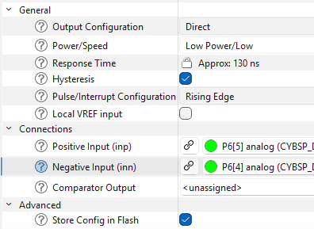

# Analog and Mixed-Signal Tests

This guide covers ADC, DAC, OPAMP, LPCOMP, and mixed-signal processing self-tests.

## ADC tests

### ADC TrigIn test

For MCPASS v3 devices, the supported ADC API in the device support matrix is `SelfTests_ADC_TrigIn()`.

The HPPASS internal CSG DAC drives the SAR input so no external stimulus is needed. The test exercises two voltage points (VDDA/3 and 2×VDDA/3) against fixed 12-bit expected results; both must fall within `ANALOG_ADC_ACURACCY` counts (default 100) to pass.

The following is an example of an ADC TrigIn self-test:

```c
uint8_t  status;
uint16_t guard;

/* --- Stimulus: VDDA/3 --- */
(void)Cy_HPPASS_AC_Start(0U, 0U);
while (Cy_HPPASS_SAR_IsBusy())
{
}
Cy_SysLib_Delay(100u);
Cy_HPPASS_DAC_SetValue((uint8_t)CYBSP_DAC_SLICE_IDX, ADC_TRIGIN_DAC_VDDA_3);
Cy_HPPASS_DAC_Start((uint8_t)CYBSP_DAC_SLICE_IDX, CY_HPPASS_DAC_HW);
(void)Cy_HPPASS_SetFwTrigger((uint8_t)CY_HPPASS_TRIG_1_MSK);
for (guard = 0u; Cy_HPPASS_DAC_IsBusy(0) && (guard < ADC_TRIGIN_DAC_SETTLE_US); guard++)
{
    Cy_SysLib_DelayUs(1u);
}

status = SelfTests_ADC_TrigIn(0u, CSG_VDAC_OUT_CHAN_IDX,
                              ADC_TRIGIN_EXP_VDDA_3, ANALOG_ADC_ACURACCY,
                              CY_HPPASS_TRIG_2_MSK);
Cy_HPPASS_DAC_Stop((uint8_t)CYBSP_DAC_SLICE_IDX);

if (OK_STATUS != status)
{
    /* Handle ADC TrigIn VDDA/3 test failure */
}

/* --- Stimulus: 2*VDDA/3 --- */
if (OK_STATUS == status)
{
    while (Cy_HPPASS_SAR_IsBusy())
    {
    }
    Cy_HPPASS_DAC_SetValue((uint8_t)CYBSP_DAC_SLICE_IDX, ADC_TRIGIN_DAC_2VDDA_3);
    Cy_HPPASS_DAC_Start((uint8_t)CYBSP_DAC_SLICE_IDX, CY_HPPASS_DAC_HW);
    (void)Cy_HPPASS_SetFwTrigger((uint8_t)CY_HPPASS_TRIG_1_MSK);
    for (guard = 0u; Cy_HPPASS_DAC_IsBusy(0) && (guard < ADC_TRIGIN_DAC_SETTLE_US); guard++)
    {
        Cy_SysLib_DelayUs(1u);
    }

    status = SelfTests_ADC_TrigIn(0u, CSG_VDAC_OUT_CHAN_IDX,
                                  ADC_TRIGIN_EXP_2VDDA_3, ANALOG_ADC_ACURACCY,
                                  CY_HPPASS_TRIG_2_MSK);
    Cy_HPPASS_DAC_Stop((uint8_t)CYBSP_DAC_SLICE_IDX);

    if (OK_STATUS != status)
    {
        /* Handle ADC TrigIn 2*VDDA/3 test failure */
    }
}
```

## DAC test

The DAC self-test sets the R2R DAC output to a known code and verifies the SAR ADC readback is within the acceptance window. The function starts the SAR conversion internally via the DAC's built-in trigger; no external settling delay is required in application code.

**Applies to:** MCPASS v3.

Both DAC instances are tested at VDD/3 and 2×VDD/3. The 12-bit DAC code and 12-bit SAR expected result are equal at each point (1365 and 2730 respectively). Both must fall within `ANALOG_ADC_ACURACCY` counts (default 100) to pass.

- DAC 0 output → AN_A5 → SAR channel 5, trigger 0
- DAC 1 output → AN_B5 → SAR channel 18, trigger 1

The following is an example of a DAC TrigIn self-test:

```c
uint8_t status;

/* --- DAC 0 (AN_A5, SAR ch 5, trigger 0): VDD/3 --- */
status = SelfTests_DAC_TrigIn(0U, DAC_TRIGIN_DAC_VDDA_3,
                              DAC_TRIGIN_EXP_VDDA_3, ANALOG_ADC_ACURACCY);
if (OK_STATUS != status)
{
    /* Handle DAC 0 VDD/3 test failure */
}

/* --- DAC 0: 2*VDD/3 --- */
if (OK_STATUS == status)
{
    status = SelfTests_DAC_TrigIn(0U, DAC_TRIGIN_DAC_2VDDA_3,
                                  DAC_TRIGIN_EXP_2VDDA_3, ANALOG_ADC_ACURACCY);
    if (OK_STATUS != status)
    {
        /* Handle DAC 0 2*VDD/3 test failure */
    }
}

/* --- DAC 1 (AN_B5, SAR ch 18, trigger 1): VDD/3 --- */
if (OK_STATUS == status)
{
    status = SelfTests_DAC_TrigIn(1U, DAC_TRIGIN_DAC_VDDA_3,
                                  DAC_TRIGIN_EXP_VDDA_3, ANALOG_ADC_ACURACCY);
    if (OK_STATUS != status)
    {
        /* Handle DAC 1 VDD/3 test failure */
    }
}

/* --- DAC 1: 2*VDD/3 --- */
if (OK_STATUS == status)
{
    status = SelfTests_DAC_TrigIn(1U, DAC_TRIGIN_DAC_2VDDA_3,
                                  DAC_TRIGIN_EXP_2VDDA_3, ANALOG_ADC_ACURACCY);
    if (OK_STATUS != status)
    {
        /* Handle DAC 1 2*VDD/3 test failure */
    }
}
```

### Generic ADC example

Analog tests verify ADC and comparator functionality by comparing measured values against known reference voltages.

The ADC test measures reference voltages such as VDDA/3 and VDDA/2 using a voltage divider and verifies the ADC reading is within tolerance. The test requires external resistor dividers to generate the reference voltages.

The following is an example of a self-test for analog tests:

```c
uint8_t status = SelfTests_ADC(0, 4, ANALOG_ADC_SAR_RESULT1, ANALOG_ADC_ACCURACY, 0, 0);

/* ADC Test - Test with VDDA/3 voltage */
/* Connect VDDA/3 signal to ADC channel 4 using a voltage divider */
if (OK_STATUS != status)
{
    /* Handle ADC test failure for VDDA/3 */
}

/* ADC Test - Test with VDDA/2 voltage */
/* Connect VDDA/2 signal to ADC channel 4 using a voltage divider */
if (OK_STATUS == status)
{
    status = SelfTests_ADC(0, 4, ANALOG_ADC_SAR_RESULT2, ANALOG_ADC_ACCURACY, 0, 0);
    if (OK_STATUS != status)
    {
        /* Handle ADC test failure for VDDA/2 */
    }
}

if (OK_STATUS == status)
{
    /* Initialize LPCOMP with Device Configurator generated structure */
    static cy_stc_lpcomp_context_t context;
    Cy_LPComp_Init_Ext(CYBSP_DUT_LPCOMP_HW, CYBSP_DUT_LPCOMP_CHANNEL,
                       &CYBSP_DUT_LPCOMP_config, &context);
    Cy_LPComp_Enable_Ext(CYBSP_DUT_LPCOMP_HW, CYBSP_DUT_LPCOMP_CHANNEL, &context);

    /* Configure AMUXBUS routing for LPCOMP inputs */
    if (CY_LPCOMP_CHANNEL_0 == CYBSP_DUT_LPCOMP_CHANNEL)
    {
        LPCOMP->CMP0_SW = LPCOMP_CMP0_SW_CMP0_AP0_Msk | LPCOMP_CMP0_SW_CMP0_BN0_Msk;
    }
    else if (CY_LPCOMP_CHANNEL_1 == CYBSP_DUT_LPCOMP_CHANNEL)
    {
        LPCOMP->CMP1_SW = LPCOMP_CMP1_SW_CMP1_AP1_Msk | LPCOMP_CMP1_SW_CMP1_BN1_Msk;
    }
    LPCOMP->CONFIG |= LPCOMP_CONFIG_ENABLED_Msk;

    /* Test with lower voltage on positive input */
    Cy_GPIO_Pin_FastInit(CYBSP_DUT_LPCOMP_VPLUS_PORT, CYBSP_DUT_LPCOMP_VPLUS_PIN,
                         CY_GPIO_DM_ANALOG, 0u, HSIOM_SEL_AMUXB);
    Cy_GPIO_Pin_FastInit(CYBSP_DUT_LPCOMP_VMINUS_PORT, CYBSP_DUT_LPCOMP_VMINUS_PIN,
                         CY_GPIO_DM_ANALOG, 0u, HSIOM_SEL_AMUXA);
    Cy_SysLib_Delay(1u);

    status = SelfTests_Comparator(CYBSP_DUT_LPCOMP_HW, CYBSP_DUT_LPCOMP_CHANNEL,
                                  ANALOG_COMP_RESULT2);
    if (OK_STATUS != status)
    {
        /* Handle LPCOMP lower voltage test failure */
    }
}

if (OK_STATUS == status)
{
    /* Test with higher voltage on positive input */
    Cy_GPIO_Pin_FastInit(CYBSP_DUT_LPCOMP_VPLUS_PORT, CYBSP_DUT_LPCOMP_VPLUS_PIN,
                         CY_GPIO_DM_ANALOG, 0u, HSIOM_SEL_AMUXA);
    Cy_GPIO_Pin_FastInit(CYBSP_DUT_LPCOMP_VMINUS_PORT, CYBSP_DUT_LPCOMP_VMINUS_PIN,
                         CY_GPIO_DM_ANALOG, 0u, HSIOM_SEL_AMUXB);
    Cy_SysLib_Delay(1u);

    status = SelfTests_Comparator(CYBSP_DUT_LPCOMP_HW, CYBSP_DUT_LPCOMP_CHANNEL,
                                  ANALOG_COMP_RESULT1);
    if (OK_STATUS != status)
    {
        /* Handle LPCOMP higher voltage test failure */
    }
}
```

## LPCOMP test

The low-power comparator test applies different voltages to the positive and negative inputs through AMUX and verifies that the comparator output matches the expected result.

Configure the LPCOMP in Device Configurator with the following settings:

- Set **Output Configuration** to `Direct`
- Set **Power/Speed** to `Low Power/Low`
- Enable **Hysteresis**
- Set **Pulse/Interrupt Configuration** to `Rising Edge`
- Leave **Local VREF input** disabled
- Set **Positive Input (inp)** to an analog-capable pin connected to AMUXBUS A
- Set **Negative Input (inn)** to an analog-capable pin connected to AMUXBUS B
- Leave **Comparator Output** unassigned

Both pins must be configured as analog drive mode. The VPLUS pin must be held at a higher voltage than the VMINUS pin. The test routes these two voltages through the AMUX buses in both directions: first applying the lower voltage to the LPCOMP positive input and then applying the higher voltage to verify that the comparator changes state correctly.



## OPAMP test

The OPAMP test verifies the configured AFE/OPAMP signal path and gain. An internal DAC generates a controlled stimulus, the AFE/OPAMP amplifies it using the configured topology and gain, and the HPPASS SAR ADC measures the output. `SelfTests_AFE_TrigIn()` compares the conversion result with the expected SAR count within the supplied tolerance. No external connection is required on devices that support an equivalent internal DAC-to-AFE-to-SAR route.

### Device Configurator setup

Configure the HPPASS analog subsystem, including its autonomous controller (AC), AFE, DAC, SAR ADC, samplers, and input trigger. The test API starts AC state 0 and issues the firmware trigger; the generated configuration must make that state and trigger start the intended SAR measurement path.

Create an internal signal chain equivalent to:

`internal DAC stimulus -> AFE/OPAMP positive input -> amplified AFE output -> SAR muxed sampler -> SAR channel`

The instance and channel numbers are examples only; another device with `HPPASS v3` can use different indices when the same logical route is preserved.

- HPPASS instance `pass[0]` is enabled and initialized, with AC instance `pass[0].ac[0]` containing state 0.
- DAC `pass[0].dac[1]` is enabled in buffered mode with buffer output select 1. Device Configurator generates its configuration object as `cy_dac_1_config` in this example.
- AFE `pass[0].afe[0]` is enabled with configuration 0 selected. Configuration 0 uses `CY_HPPASS_AFE_INPUT_SRC_DAC` for the positive input, `CY_HPPASS_AFE_INPUT_SRC_GND` for the negative input, and `CY_HPPASS_AFE_INT_SEIN_SEOUT_PGA` output mode with `CY_HPPASS_AFE_GAIN_2`.
- SAR `pass[0].sar[0]` uses VDDA as its reference. Channel `pass[0].sar[0].ch[21]` is the AFE output result channel.
- Muxed sampler `pass[0].sar[0].muxed_sampler[1]` is enabled by SAR sequence group `pass[0].sar[0].seq[0].grp[0]`, which selects mux input 3 and uses `CY_HPPASS_SAR_TRIG_0`.
- HPPASS input trigger 0 is configured for `CY_HPPASS_TR_FW_PULSE`, matching the `CY_HPPASS_TRIG_0_MSK` firmware-trigger mask passed to the test API.

The names generated by Device Configurator depend on the aliases chosen in the design. Record the DAC configuration object, AFE output SAR channel, and firmware trigger mask used by the selected route, then use those same resources in the application code.

### Application-owned resources

The application owns the DAC instance and its generated configuration object, the AFE output/SAR result-channel index, trigger mask, DAC input codes, expected SAR results, conversion tolerance, and bounded DAC ready/update timeouts. The application also owns any resource restoration required after the test.

The reference values in the following setup are specific to a 12-bit DAC, a 12-bit SAR with VDDA reference, and the configured AFE topology and gain. Recalculate the DAC codes, expected SAR counts, and tolerance for a different DAC resolution, SAR resolution, gain, topology, or reference voltage.

```c
/* These values match the configured DAC-to-AFE-to-SAR route. */
#define STL_OPAMP_DAC_INDEX                 (1U)
#define STL_OPAMP_SAR_GROUP                 (0U)
#define STL_OPAMP_SAR_CHANNEL               (21U)
#define STL_OPAMP_TRIGGER_MASK              (CY_HPPASS_TRIG_0_MSK)
#define STL_OPAMP_FIRST_DAC_CODE            (1024U)
#define STL_OPAMP_SECOND_DAC_CODE           (455U)
#define STL_OPAMP_FIRST_EXPECTED_RESULT     (3071)
#define STL_OPAMP_SECOND_EXPECTED_RESULT    (1365)
#define STL_OPAMP_CONVERSION_TOLERANCE      (ANALOG_ADC_ACCURACY)
#define STL_OPAMP_DAC_READY_TIMEOUT_US      (1000U)
#define STL_OPAMP_DAC_UPDATE_TIMEOUT_US     (1000U)
#define STL_OPAMP_DAC_CONFIG                (&cy_dac_1_config)

static uint8_t stlOpampWriteDacStimulus(uint8_t dacIndex, uint32_t dacCode)
{
    uint32_t timeout = 0U;

    while ((!Cy_HPPASS_DAC_Is_Ready(dacIndex)) && (timeout < STL_OPAMP_DAC_READY_TIMEOUT_US))
    {
        Cy_SysLib_DelayUs(1U);
        timeout++;
    }

    if (!Cy_HPPASS_DAC_Is_Ready(dacIndex))
    {
        return ERROR_STATUS;
    }

    Cy_HPPASS_DAC_ModeSet(dacIndex, CY_HPPASS_DAC_BUF_MODE_BUFFERED);
    Cy_HPPASS_DAC_WriteValue(dacIndex, dacCode);

    timeout = 0U;
    while ((Cy_HPPASS_DAC_Buf_IsBusy(dacIndex)) && (timeout < STL_OPAMP_DAC_UPDATE_TIMEOUT_US))
    {
        Cy_SysLib_DelayUs(1U);
        timeout++;
    }

    return Cy_HPPASS_DAC_Buf_IsBusy(dacIndex) ? ERROR_STATUS : OK_STATUS;
}
```

`SelfTests_AFE_TrigIn()` does not initialize the DAC, select its mode, write its value, or create the AFE-to-SAR route. It starts HPPASS AC state 0, waits for the SAR conversion, issues the supplied firmware trigger, reads and clears the selected SAR result status, and checks the result against `expected_res +/- accuracy`.

Pass the configured SAR group as `group`, the AFE output result-channel index as `channel`, the calculated count as `expected_res`, the allowed count deviation as `accuracy`, and the firmware-trigger bit mask that starts the sequence group as `trig_in`.

### API sequence

Initialize and enable the selected DAC, start AC state 0, and wait for the DAC to become ready. Select buffered mode, write a stimulus code, and wait for the DAC buffer update using a bounded timeout. Call `SelfTests_AFE_TrigIn()` with the matching SAR group, result channel, expected result, tolerance, and trigger mask. Check its returned status, repeat with a second stimulus level where appropriate, then deinitialize or restore the DAC.

The following application-side sequence uses two levels and always deinitializes the DAC before returning. The DAC-ready and buffer-update loops are bounded; handle `ERROR_STATUS` as a failed preparation or self-test result.

```c
uint8_t status = OK_STATUS;

Cy_HPPASS_DAC_Init(STL_OPAMP_DAC_INDEX, STL_OPAMP_DAC_CONFIG);
Cy_HPPASS_DAC_Enable(STL_OPAMP_DAC_INDEX);

if (CY_HPPASS_SUCCESS != Cy_HPPASS_AC_Start(0U, 0U))
{
    status = ERROR_STATUS;
}

if (OK_STATUS == status)
{
    status = stlOpampWriteDacStimulus(STL_OPAMP_DAC_INDEX, STL_OPAMP_FIRST_DAC_CODE);
    if (OK_STATUS != status)
    {
        /* Handle first DAC stimulus preparation failure */
    }
}

if (OK_STATUS == status)
{
    status = SelfTests_AFE_TrigIn(STL_OPAMP_SAR_GROUP, STL_OPAMP_SAR_CHANNEL,
                                  STL_OPAMP_FIRST_EXPECTED_RESULT,
                                  STL_OPAMP_CONVERSION_TOLERANCE,
                                  STL_OPAMP_TRIGGER_MASK);
    if (OK_STATUS != status)
    {
        /* Handle first OPAMP self-test failure */
    }
}

if (OK_STATUS == status)
{
    status = stlOpampWriteDacStimulus(STL_OPAMP_DAC_INDEX, STL_OPAMP_SECOND_DAC_CODE);
    if (OK_STATUS != status)
    {
        /* Handle second DAC stimulus preparation failure */
    }
}

if (OK_STATUS == status)
{
    status = SelfTests_AFE_TrigIn(STL_OPAMP_SAR_GROUP, STL_OPAMP_SAR_CHANNEL,
                                  STL_OPAMP_SECOND_EXPECTED_RESULT,
                                  STL_OPAMP_CONVERSION_TOLERANCE,
                                  STL_OPAMP_TRIGGER_MASK);
    if (OK_STATUS != status)
    {
        /* Handle second OPAMP self-test failure */
    }
}

Cy_HPPASS_DAC_DeInit(STL_OPAMP_DAC_INDEX);
```

## ATOP tests

These tests apply to the PPCA analog subsystem. In Device Configurator, allocate each ATOP resource to the processor that runs the self-test and keep the PPCA subsystem available. The verified reference design uses the `PPCA_CNFG` alias, assigns ADC groups 0-3 and DCSG groups 0-1 to CPU0, and leaves PPCA clock shutdown disabled.

Call `init_cycfg_all()` before the examples, then enable PPCA before accessing an ATOP resource. ATOP ADC, AREF, DCSG, and DAC resources are shared; serialize each self-test with application use. The APIs below do not share an identical setup contract, so each subsection states its own AREF and resource-ownership requirements. When the application owns a resource before the test, preserve and restore its operating state around the test sequence.

### ATOP ADC Core

The ADC Core self-test validates the 12-bit SAR conversion path, AFE input stage, AUX multiplexer, trigger/busy logic, and result-read path. For the on-chip test it routes the internal 1.2 V VREF through the Group 0 AUX path on channel 7 and compares the conversion code with the configured acceptance window.

#### Supported configuration and limitations

`SelfTest_ATOP_ADC_Core(const stl_atop_adc_core_config_t* config)` accepts a non-NULL configuration with an expected code from 0 through 4095 and a non-zero tolerance. `adcGroup`, `channel`, and `refSource` select one of these paths:

- `CY_STL_ATOP_ADC_REF_VREF_1V2` is supported only on Group 0, channel 7 (`ATOP_ADC_CORE_AUX_CHANNEL`). This is the self-contained on-chip reference test.
- `CY_STL_ATOP_ADC_REF_EXTERNAL` uses an application-provided known voltage on a regular ADC channel. Groups 0 and 3 support channels 0-7; groups 1 and 2 support channels 0-3. The application must provide the expected 12-bit code and a justified tolerance for its supply voltage and external stimulus.

Groups 1-3 have no internal VREF stimulus in this API. Their coverage therefore requires an external, known source and an application-owned analog route. Unsupported combinations, a NULL configuration, an expected code above 4095, or a zero tolerance return `ERROR_BAD_PARAM` before the API accesses hardware.

#### Device Configurator setup

Add the PPCA configuration, ATOP, ADC Group 0, and Group 0 AREF personalities, and allocate Group 0 to the processor running the test. The verified M8 design uses `ADC_0` for `ppca[0].atop[0].adc_grp[0].adc[0]`, `AREF` for `ppca[0].atop[0].adc_grp[0].aref[0]`, and locally generated VREF. It deliberately leaves generated ADC and AREF initialization disabled because the application sequence initializes the reference and the self-test configures ADC and AFE for the measurement.

For a different compatible device, the generated aliases and the application-owned external channel can differ. Preserve the logical route: Group 0 AREF with locally generated VREF, AUX channel 7 for the internal reference, or a valid regular channel connected to a calibrated external source.

#### Application resources and API sequence

The application owns PPCA enablement, ATOP allocation, AREF initialization and readiness, external stimulus routing, and its chosen `stl_atop_adc_core_config_t`. For the Group 0 VREF test, initialize and enable AREF with locally generated VREF, assert its analog control, and poll `Cy_PPCA_AREF_Get_VDDA_Status()` with a bounded timeout before calling the API. The self-test itself reasserts Group 0 AREF analog control after enabling ADC and waits for its internal settle interval.

The API saves and restores the ADC and AFE registers that it changes. It does not restore the top-level PPCA state or the Group 0 AREF state, so the application must restore those resources when it owns them. `OK_STATUS` indicates a conversion inside the configured tolerance; `ERROR_STATUS` indicates a conversion timeout, busy condition, or out-of-tolerance result.

The following setup uses the M8 reference aliases and a 500 ms bounded AREF-ready wait. It owns the PPCA and AREF enable state and releases both after the test; an application that already uses either resource must instead restore its own saved state.

```c
#define STL_ATOP_ADC_CORE_AREF_READY_TIMEOUT_MS   (500U)

static const cy_stc_ppca_aref_config_t stlAtopAdcCoreArefConfig =
{
    .aref_mode            = false,
    .enable_current_to_ts = false,
    .analog_ctrl          = CY_AREF_FORCE_POR_1,
    .vref_source_sel      = CY_LOCALLY_GENERATED_VREF,
};

static uint8_t stlAtopAdcCoreEnableReference(void)
{
    Cy_PPCA_Enable(PPCA_CNFG);
    Cy_PPCA_AREF_Init(AREF_HW, &stlAtopAdcCoreArefConfig);
    Cy_PPCA_AREF_Enable(AREF_HW);
    Cy_PPCA_AREF_SetAnalogCtrl(AREF_HW, CY_AREF_FORCE_POR_1);

    for (uint32_t elapsedMs = 0U;
         elapsedMs < STL_ATOP_ADC_CORE_AREF_READY_TIMEOUT_MS;
         elapsedMs++)
    {
        if (Cy_PPCA_AREF_Get_VDDA_Status(AREF_HW))
        {
            return OK_STATUS;
        }
        Cy_SysLib_Delay(1U);
    }

    return ERROR_STATUS;
}

static void stlAtopAdcCoreDisableReference(void)
{
    Cy_PPCA_AREF_Disable(AREF_HW);
    Cy_PPCA_Disable(PPCA_CNFG);
}
```

The following example runs the ready-made Group 0 VREF configuration:

```c
uint8_t status = stlAtopAdcCoreEnableReference();

if (OK_STATUS == status)
{
    const stl_atop_adc_core_config_t adcCoreConfig = ATOP_ADC_CORE_CONFIG_GRP0_VREF;
    status = SelfTest_ATOP_ADC_Core(&adcCoreConfig);
    if (OK_STATUS != status)
    {
        /* Handle the ADC Core self-test failure. */
    }
}

/* This example owns the PPCA and AREF enable state established above. */
stlAtopAdcCoreDisableReference();
```

### ATOP ADC Filter

The ATOP ADC Filter self-test validates the digital processing chain after an ADC conversion on devices with PPCA ATOP IP. It applies known values through the selected group's ADC test-injection path, tests every filter instance in that group, and compares the output with the expected result. No external analog stimulus or pin routing is required.

`SelfTest_ATOP_ADC_Filter(uint8_t adcGroup, uint8_t testMask)` accepts groups 0 through 3. The instances are not distributed uniformly: Group 0 contains `ADC_FILT_00` and `ADC_FILT_01`, Groups 1 and 2 each contain one instance (`ADC_FILT_10` and `ADC_FILT_20`), and Group 3 contains `ADC_FILT_30` and `ADC_FILT_31`. A call exercises every instance in the selected group.

#### Filter-test selection

`testMask` selects one or more subtests with a bitwise OR. `ATOP_ADC_FILTER_TEST_ALL` selects all six. Bits outside this set are ignored; a mask containing no valid bit returns `ERROR_BAD_PARAM` before hardware access.

| Mask | Coverage |
| --- | --- |
| `ATOP_ADC_FILTER_TEST_MEDIAN` | Runs the Median datapath with two injected levels and verifies that its output tracks both values. |
| `ATOP_ADC_FILTER_TEST_LINTP` | Checks the writable `LIF_CNFG` linear-interpolation configuration fields with write/read-back patterns. The functional LINTP output requires independent hardware start timing, so this subtest does not claim a functional injected-data check. |
| `ATOP_ADC_FILTER_TEST_LPF` | Runs the low-pass filter with settled constant input levels and verifies its DC output. |
| `ATOP_ADC_FILTER_TEST_CIC3` | Runs the third-order comb filter with settled constant input levels and verifies the gain-corrected output. |
| `ATOP_ADC_FILTER_TEST_AVG` | Runs the fixed-window linear average filter and verifies the recovered average of injected samples. |
| `ATOP_ADC_FILTER_TEST_MINMAX` | Runs the minimum/maximum detector over a known varying sample sequence. |
| `ATOP_ADC_FILTER_TEST_ALL` | Bitwise combination of all six filter tests. |

#### Device Configurator setup

Add the PPCA ATOP and ADC Group personalities, then allocate every ADC group that the application will test to the processor running the test. Add the Group 0 AREF personality when testing Group 0. The verified M8 reference design uses `PPCA_CNFG` for `ppca[0].ppca_cnfg[0]`, `ADC_0` for `ppca[0].atop[0].adc_grp[0].adc[0]`, and `AREF` for `ppca[0].atop[0].adc_grp[0].aref[0]`; `AREF` uses `CY_LOCALLY_GENERATED_VREF`. Its `PPCA_CNFG` configuration assigns ADC Groups 0-3 to CPU0 and leaves PPCA clock shutdown disabled.

The API addresses the fixed filter instances directly and supplies its temporary ADC and filter configurations internally. It does not consume a generated filter alias or filter configuration object, so do not create a filter instance solely for this API. On another compatible M8 device, preserve the same logical allocation: the chosen ADC group, its hardware filter instances, PPCA access, and Group 0 AREF when Group 0 is selected.

#### Resource ownership and API sequence

Initialize the generated PPCA configuration and reserve the selected ADC group and all of its filter instances for the entire call. The API enables PPCA, configures the selected ADC group for test-data injection on channel 0, disables calibration-gain mode, and configures one filter stage at a time. It temporarily changes PPCA control and the selected ADC's `ADC_CNFG`, `ADC_CTL`, `ADC_CNV_CNFG`, `ADC_CH_CNFG0`, `ADC_CH_CNFG1`, and `ADC_SIGN_UNSIGN_CNFG` registers. Each filter subtest saves and restores its `CTL` and `CNFG` registers and, where used, the LPF, AVG, CIC3, or LINTP configuration register.

The API restores the saved PPCA control, selected ADC configuration, and filter configuration before it returns. When Group 0 is tested, it enables Group 0 AREF for the test and disables it on return rather than restoring a pre-existing enabled AREF state. Treat Group 0 AREF as a shared, application-owned resource and restore it if the application was already using it.

Do not access the selected group's ADC or filter outputs concurrently with the self-test. The API does not reconfigure ADC or filter registers in the other groups, so their saved configurations are unaffected; nevertheless, serialize calls because PPCA control and Group 0 AREF are shared. `OK_STATUS` means every selected test passed. `ERROR_STATUS` indicates an out-of-tolerance filter result or a conversion timeout. `ERROR_BAD_PARAM` indicates an invalid group or a mask with no valid test bit.

The following example initializes the reference PPCA configuration, tests every filter type in Group 0, handles both failure classes, and releases PPCA. An application that already owns PPCA or AREF must restore its own prior state instead of unconditionally disabling it.

```c
uint8_t status;

/* Initialize and enable the PPCA configuration that owns ADC Group 0. */
Cy_PPCA_CNFG_Init(PPCA_CNFG, &PPCA_CNFG_config);
Cy_PPCA_Enable(PPCA_CNFG);

status = SelfTest_ATOP_ADC_Filter(ATOP_ADC_FILTER_GROUP_0,
                                  ATOP_ADC_FILTER_TEST_ALL);

if (ERROR_BAD_PARAM == status)
{
    /* Handle an unsupported ADC group or empty filter-test selection. */
}
else if (ERROR_STATUS == status)
{
    /* Handle a filter result outside tolerance or conversion timeout. */
}

/* This example owns the PPCA enable state established above. */
Cy_PPCA_Disable(PPCA_CNFG);
```

### ATOP AFE

The ATOP AFE self-test verifies the programmable-gain path using an externally applied differential input. It supports one AFE on differential channel 0 of each ADC group; the API selects the corresponding ADC and AFE base internally and does not accept an arbitrary ADC channel.

| Group | Macro | External differential pins |
| --- | --- | --- |
| 0 | `ATOP_AFE_GROUP_0` | AIN0P / AIN0N |
| 1 | `ATOP_AFE_GROUP_1` | AIN4P / AIN4N |
| 2 | `ATOP_AFE_GROUP_2` | AIN6P / AIN6N |
| 3 | `ATOP_AFE_GROUP_3` | AIN8P / AIN8N |

`ATOP_AFE_GROUP_COUNT` is 4. Call the configuration-based API for the selected group:

```c
uint8_t SelfTest_ATOP_AFE(const stl_atop_afe_config_t* config);
```

#### External stimulus and pin mapping

This is an **EXTERNAL-reference test**. Before calling the API, apply and stabilize a small differential voltage on the selected pin pair. Both pins must remain within `[VSSA - 0.25 V, 1 V]`; keep the differential small enough that the 16.5x measurement stays on-scale. A raw differential code of a few tens is an appropriate operating region.

The ready-made `ATOP_AFE_CONFIG_GRP0_DEFAULT` selects `ATOP_AFE_GROUP_0`, `ATOP_AFE_DEFAULT_RAW_MIN` = 40, `ATOP_AFE_DEFAULT_RAW_MAX` = 120, and `ATOP_AFE_DEFAULT_TOLERANCE_PCT` = 25. These are suggested defaults for a small positive Group 0 stimulus, not universal limits for every external source. On `KIT_PSC3M8_EVK`, the focused Group 0 example uses R212 on AIN0P and R221 on AIN0N; these trimmers are board-specific and are not an API prerequisite.

A missing, reversed, excessive, saturated, or otherwise out-of-window stimulus returns `ERROR_STATUS`.

#### Device Configurator and application setup

Initialize the generated system and PPCA configuration, allocate every ADC group that the application will test to the processor running the test, and enable the top-level PPCA block before accessing ATOP resources. Initialize and enable the shared Group 0 AREF with locally generated VREF, set its analog control to `CY_AREF_FORCE_POR_1`, and wait for `Cy_PPCA_AREF_Get_VDDA_Status()` with a bounded timeout before calling the self-test.

The AREF is physically shared from ADC Group 0 and is required even when testing AFE groups 1, 2, or 3. Keep the selected ADC/AFE and the shared AREF exclusively available during the test. The application owns processor allocation, PPCA initialization and enable state, Group 0 AREF initialization, readiness and enable state, external stimulus setup, and concurrency control.

#### Configuration and acceptance criteria

Configure one test run with:

```c
typedef struct
{
	uint8_t  adcGroup;
	int32_t  rawMin;
	int32_t  rawMax;
	uint16_t gainTolerancePercent;
} stl_atop_afe_config_t;
```

The API validates `config` before accessing hardware: it must be non-NULL, `adcGroup` must be less than `ATOP_AFE_GROUP_COUNT`, `gainTolerancePercent` must be 1 through 100, and `rawMin` must be less than `rawMax`. Invalid configuration returns `ERROR_BAD_PARAM` without hardware access.

The test converts the same differential input three times: with the AFE disabled for the raw signed ADC code, with `CY_AFE_GAIN_3` (nominally 8.25x), and with `CY_AFE_GAIN_6` (nominally 16.5x). It passes only when the raw code is inside `config->rawMin` through `config->rawMax`, neither amplified code is saturated, the 8.25x and 16.5x codes match the raw code scaled by 33/4 and 33/2, and the 16.5x result is approximately twice the 8.25x result. Each comparison uses the caller-supplied percentage tolerance plus `ATOP_AFE_CODE_NOISE_FLOOR`.

The public gain and acceptance constants are `ATOP_AFE_GAIN_LOW_NUM` / `ATOP_AFE_GAIN_LOW_DEN`, `ATOP_AFE_GAIN_HIGH_NUM` / `ATOP_AFE_GAIN_HIGH_DEN`, `ATOP_AFE_GAIN_RATIO`, `ATOP_AFE_SATURATION_CODE` = 2040, and `ATOP_AFE_CODE_NOISE_FLOOR` = 48.

`OK_STATUS` means all raw-window, saturation, gain, and ratio checks passed. `ERROR_STATUS` means the raw stimulus was outside its configured window, a reading saturated, or a gain or ratio was outside tolerance. `MTB_STL_ERROR_TIMEOUT` means an ADC conversion timed out.

#### Resource ownership and restoration

The API configures and temporarily enables the selected group's ADC and AFE. It saves and restores the ADC control and configuration, conversion configuration, regular channel configurations, AUX and alternate-AUX configuration, signed/unsigned configuration, and AFE control and configuration. It stops after the first conversion error and restores the selected ADC/AFE registers before returning.

The API reasserts Group 0 AREF analog control while converting, but does not save and restore AREF state. ADC/AFE state is restored; PPCA, AREF, and external stimulus remain application-owned. An application that enabled PPCA or AREF for the sequence must restore its own enable policy afterward.

#### API sequence

The following Group 0 example owns and releases the PPCA and AREF enable states. It waits for AREF readiness with a bounded loop; an application already using either shared resource must instead preserve its prior state.

```c
const cy_stc_ppca_aref_config_t afeArefConfig =
{
    .aref_mode            = false,
    .enable_current_to_ts = false,
    .analog_ctrl          = CY_AREF_FORCE_POR_1,
    .vref_source_sel      = CY_LOCALLY_GENERATED_VREF,
};
const stl_atop_afe_config_t afeConfig = ATOP_AFE_CONFIG_GRP0_DEFAULT;
const uint32_t arefReadyTimeoutMs = 500U;
bool arefReady = false;
uint8_t status = OK_STATUS;

/* Initialize and enable the generated PPCA configuration before accessing
 * the shared Group 0 AREF. */
Cy_PPCA_CNFG_Init(PPCA_CNFG, &PPCA_CNFG_config);
Cy_PPCA_Enable(PPCA_CNFG);
Cy_PPCA_AREF_Init(AREF_HW, &afeArefConfig);
Cy_PPCA_AREF_Enable(AREF_HW);
Cy_PPCA_AREF_SetAnalogCtrl(AREF_HW, CY_AREF_FORCE_POR_1);

for (uint32_t elapsedMs = 0U; elapsedMs < arefReadyTimeoutMs; elapsedMs++)
{
    if (Cy_PPCA_AREF_Get_VDDA_Status(AREF_HW))
    {
        arefReady = true;
        break;
    }
    Cy_SysLib_Delay(1U);
}

if (!arefReady)
{
    status = ERROR_STATUS;
}
else
{
    /* Apply a stable external differential on AIN0P/AIN0N within the
     * configured raw-code window before calling this self-test. */
    status = SelfTest_ATOP_AFE(&afeConfig);
}

if (ERROR_BAD_PARAM == status)
{
    /* Handle an invalid AFE configuration. */
}
else if (MTB_STL_ERROR_TIMEOUT == status)
{
    /* Handle an ADC conversion timeout. */
}
else if (ERROR_STATUS == status)
{
    /* Handle AREF readiness, stimulus, saturation, or gain failure. */
}

/* This example owns the AREF and PPCA enable state established above. */
Cy_PPCA_AREF_Disable(AREF_HW);
Cy_PPCA_Disable(PPCA_CNFG);
```

### ATOP DAC test

The ATOP DAC self-test is a test for devices with PPCA ATOP IP. It configures a 12-bit R2R DAC in internal single-ended loopback mode, routes the output through the Group 0 ADC AUX channel 7 path, and checks each ADC result against the programmed DAC code. No external analog wiring or stimulus is required.

`SelfTests_ATOP_DAC(uint32_t adcChannel, uint32_t dacSlice, const uint32_t* dacVals, uint32_t numVals, uint16_t accuracy)` accepts only `ATOP_ADC_CHANNEL_0`, DAC slice 0 or 1, a non-NULL non-empty code array, codes from 0 through 4095, and an accuracy no greater than 2047. In loopback mode, DAC and ADC use the same reference, so the expected ADC code is the DAC code within `accuracy`.

#### Device Configurator setup

Allocate ADC Group 0 and the DCSG group for every DAC slice under test to the processor running the test, then generate a PPCA configuration alias. The verified M8 reference design uses `PPCA_CNFG`, assigns ADC Group 0 and DCSG groups 0 and 1 to CPU0, and leaves PPCA clock shutdown disabled. It tests both slices with codes 0, 2048, and 4095 and an accuracy of 50 codes.

Slice 0 uses `DCSG_GRP_0` and `CY_DAC_R2R0_OUTPUT`; slice 1 uses `DCSG_GRP_1` and `CY_DAC_R2R1_OUTPUT`. Both loop back to ADC Group 0 through its AUX multiplexer. The API configures these internal signal paths directly, so no pin route is needed. Aliases and allocation ownership can differ on another compatible device, but the DAC slice must retain its matching DCSG group and Group 0 ADC loopback path.

#### Resource ownership and API sequence

Before calling the API, enable PPCA and reserve ADC Group 0, its AREF, the selected DCSG group, and the selected DAC slice from concurrent application use. The API initializes and restores the AREF, selected DCSG slice, selected DAC, and Group 0 ADC registers used by the loopback test. It does not enable or restore the top-level PPCA control state.

Run the test once for each allocated DAC slice, check `OK_STATUS`, and restore the top-level PPCA state if the application enabled it for this sequence. `ERROR_STATUS` reports an out-of-tolerance conversion, `MTB_STL_ERROR_TIMEOUT` reports an ADC conversion timeout, and `ERROR_BAD_PARAM` reports invalid arguments.

The following example owns PPCA enablement, tests both verified DAC slices, and releases PPCA afterward. In an application that already owns PPCA, preserve that pre-existing state instead of disabling it unconditionally.

```c
static const uint32_t dacValues[] = { 0U, 2048U, 4095U };
const uint32_t dacValueCount = sizeof(dacValues) / sizeof(dacValues[0]);
uint8_t status;

Cy_PPCA_Enable(PPCA_CNFG);

status = SelfTests_ATOP_DAC(ATOP_ADC_CHANNEL_0, ATOP_DAC_SLICE_0,
                            dacValues, dacValueCount, 50U);
if (OK_STATUS == status)
{
    status = SelfTests_ATOP_DAC(ATOP_ADC_CHANNEL_0, ATOP_DAC_SLICE_1,
                                dacValues, dacValueCount, 50U);
}

if (OK_STATUS != status)
{
    /* Handle the DAC self-test failure. */
}

/* This example owns the PPCA enable state established above. */
Cy_PPCA_Disable(PPCA_CNFG);
```

### ATOP DCMP

`SelfTests_ATOP_DCMP()` verifies one configured ATOP digital comparator by injecting test data through its ADC. It requires an ADC, DCMP, and routed ADC channel that are already initialized and enabled:

```c
uint8_t SelfTests_ATOP_DCMP(
	ATOPSS_ADC_TYPE* adcBase,
	ATOPSS_DCMP_TYPE* dcmpBase);
```

The API writes threshold `0x800`, detects a negative threshold representation for a signed channel, and changes that threshold to zero when needed. It injects the three 12-bit ADC values `0xFFF`, `0x800`, and `0x000`; their expected comparator results are true, false, and false.

The function stops at the first comparator mismatch or conversion timeout. `OK_STATUS` means all three comparisons matched, `ERROR_STATUS` means a comparator result mismatched, and `MTB_STL_ERROR_TIMEOUT` means the ADC remained busy after the bounded wait. The wait uses at most 100 iterations of `Cy_SysLib_DelayUs(1U)`, or approximately 100 us for each injected value.

#### Device Configurator setup

First add the PPCA/ATOP configuration and allocate the ADC group to the processor that calls the API. Configure an ADC with the channels used by the DCMP instances. Each channel should be single-ended. Configure AREF for that ADC group, and add one DCMP personality for every comparator to test. Set each DCMP comparison mode to `CY_DCMP_MODE_IMMEDIATE_COMPARISON` and choose it's source channel. Initialize and enable PPCA, AREF, ADC, and every selected DCMP before testing and disable ADC calibration-gain mode for this injected-value flow.

The verified M8 reference configuration allocates `adcGrp0` to `CY_ALLOCATE_PERIPHERAL_TO_CPU0`. It uses `ADC_0_HW` on ADC Group 0 with channels 0 and 1, `AREF_HW` for the Group 0 AREF, `DCMP_0_HW` with source channel 0, and `DCMP_1_HW` with source channel 1. The generated configuration objects are `PPCA_CNFG_config`, `ADC_0_config`, `AREF_config`, `DCMP_0_config`, and `DCMP_1_config`. These aliases are a verified reference configuration, not required names for every design.

#### Ownership, and API sequence

Before runnning test, user should disable calibration-gain mode, and run the configured DCMP calls.

`SelfTests_ATOP_DCMP()` does not initialize or enable PPCA, AREF, ADC, or DCMP, and does not save or restore application configuration. It writes the selected DCMP threshold and ADC test data, triggers ADC conversions and the selected DCMP, and does not restore the prior threshold. The application owns initialization, enable state, test-mode and calibration-mode setup, plus teardown and restoration. Reserve the selected ADC, AREF, DCMP, and routed channel exclusively; do not run normal ADC sampling or use the selected comparator concurrently. An application that already uses these resources must save and restore its own state.

The following example owns and initializes the reference resources, then disables those resources after the test:

```c
uint8_t status;

/* Initialize and enable the generated resources used by both DCMP paths. */
Cy_PPCA_CNFG_Init(PPCA_CNFG, &PPCA_CNFG_config);
Cy_PPCA_ADC_Init(ADC_0_HW, &ADC_0_config);
Cy_PPCA_AREF_Init(AREF_HW, &AREF_config);
Cy_PPCA_DCMP_Init(DCMP_0_HW, &DCMP_0_config);
Cy_PPCA_DCMP_Init(DCMP_1_HW, &DCMP_1_config);
Cy_PPCA_Enable(PPCA_CNFG);
Cy_PPCA_AREF_Enable(AREF_HW);
Cy_PPCA_ADC_Enable(ADC_0_HW);
Cy_PPCA_DCMP_Enable(DCMP_0_HW);
Cy_PPCA_DCMP_Enable(DCMP_1_HW);

Cy_PPCA_ADC_Set_Calib_Gain_mode(ADC_0_HW, false);

status = SelfTests_ATOP_DCMP(ADC_0_HW, DCMP_0_HW);
if (OK_STATUS == status)
{
    status = SelfTests_ATOP_DCMP(ADC_0_HW, DCMP_1_HW);
}

if (MTB_STL_ERROR_TIMEOUT == status)
{
    /* Handle the ADC conversion timeout. */
}
else if (ERROR_STATUS == status)
{
    /* Handle the DCMP diagnostic failure. */
}

/* This example owns the test mode and enabled resources. */
Cy_PPCA_ADC_Set_Test_mode(ADC_0_HW, false);
Cy_PPCA_DCMP_Disable(DCMP_1_HW);
Cy_PPCA_DCMP_Disable(DCMP_0_HW);
Cy_PPCA_ADC_Disable(ADC_0_HW);
Cy_PPCA_AREF_Disable(AREF_HW);
Cy_PPCA_Disable(PPCA_CNFG);
```

### ATOP DCSG

`SelfTests_ATOP_DCSG()` verifies one DCSG slice and its group DAC R2R through the internal `DAC R2R -> DCSG comparator` path. The DCSG slope generator supplies the threshold, so no external pin, route, or analog stimulus is required:

```c
uint8_t SelfTests_ATOP_DCSG(
	PPCA_ATOPSS_DCSG_GRP_DAC_R2R_Type* dacBase,
	PPCA_ATOPSS_DCSG_GRP_DCSG_SLICE_Type* dcsgBase);
```

The first case writes DAC value 4095 with threshold 500 and expects a true comparator flag. The second writes DAC value 0 with threshold 3500 and expects false. The implementation waits 10 ms for DAC settling in each case, so one successful call validates both states for one slice. `OK_STATUS` means both states matched; `ERROR_STATUS` means a mismatch or a NULL base pointer. The function stops after the first failed comparator state.

#### Topology and reference coverage

On PSOC Control C3 M8, DCSG Group 0 has one DAC R2R and six slices, indices 0 through 5; Group 1 has one DAC R2R and three slices, indices 0 through 2. The verified M8 reference configuration allocates `dcsgGrp0` and `dcsgGrp1` to `CY_ALLOCATE_PERIPHERAL_TO_CPU0`. Use `PPCA_ATOPSS_DCSG_GRP0_DAC_R2R` with `&PPCA_ATOPSS_DCSG_GRP0_DCSG_SLICE0[sliceIndex]` for Group 0, and `PPCA_ATOPSS_DCSG_GRP1_DAC_R2R` with `&PPCA_ATOPSS_DCSG_GRP1_DCSG_SLICE0[sliceIndex]` for Group 1.

The concrete slice counts are verified for M8. Check the target device's PDL layout before applying these counts to another compatible device; this API does not provide public slice-count macros.

#### Setup and ownership

Initialize the generated system/PPCA configuration and enable the top-level PPCA block before calling the API. The application owns the top-level PPCA enable/disable policy. The API initializes and enables Group 0 AREF, the selected group DAC R2R, and the selected DCSG slice. It saves and restores Group 0 AREF control and analog-control registers; the selected DAC control and configuration registers; and the selected DCSG slice control and configuration registers. It disables the temporary AREF, DAC, and DCSG setup before restoring those registers. It does not manage the top-level PPCA enable state.

Only the selected slice registers change, but the group DAC is shared by every slice in that DCSG group. Group 0 AREF is also shared with ADC, AFE, DAC, and other ATOP users. Reserve Group 0 AREF, the selected group DAC, and selected DCSG slice exclusively. Do not run this API concurrently with ATOP DAC, AFE, another DCSG slice in the same group, or application use of the shared DAC/AREF resources.

The following example enables PPCA, tests every verified M8 slice, then disables PPCA because it owns that enable state:

```c
static const uint32_t group0SliceCount = 6U;
static const uint32_t group1SliceCount = 3U;
uint8_t status = OK_STATUS;
uint32_t sliceIndex;

Cy_PPCA_CNFG_Init(PPCA_CNFG, &PPCA_CNFG_config);
Cy_PPCA_Enable(PPCA_CNFG);

for (sliceIndex = 0U; (sliceIndex < group0SliceCount) && (OK_STATUS == status); sliceIndex++)
{
    status = SelfTests_ATOP_DCSG(PPCA_ATOPSS_DCSG_GRP0_DAC_R2R,
                                 &PPCA_ATOPSS_DCSG_GRP0_DCSG_SLICE0[sliceIndex]);
}

for (sliceIndex = 0U; (sliceIndex < group1SliceCount) && (OK_STATUS == status); sliceIndex++)
{
    status = SelfTests_ATOP_DCSG(PPCA_ATOPSS_DCSG_GRP1_DAC_R2R,
                                 &PPCA_ATOPSS_DCSG_GRP1_DCSG_SLICE0[sliceIndex]);
}

if (OK_STATUS != status)
{
    /* Handle the DCSG diagnostic failure. */
}

/* This example owns the PPCA enable state established above. */
Cy_PPCA_Disable(PPCA_CNFG);
```

## HWFILT3P3Z test

### HPPASS implementation

This implementation applies to devices with the HPASS v3 IP. `SelfTest_HWFILT3P3Z_HPPASS(filtIdx)` selects one HPPASS filter instance; its index is not a PPCA stack or channel selection. The API configures the selected filter for a frequency-response check driven through the AHB interface, then restores its configuration and enable state.

The following example runs the `SelfTest_HWFILT3P3Z_HPPASS()` self-test across all supported HPPASS filter instances:

```c
uint8_t status = OK_STATUS;

for (uint8_t filter = 0U; filter <= HWFILT3P3Z_HPPASS_MAX_IDX; filter++)
{
    status = SelfTest_HWFILT3P3Z_HPPASS(filter);
    if (OK_STATUS != status)
    {
        /* Handle HWFILT3P3Z HPPASS filter test failure */
        break;
    }
}
```

### PPCA implementation

This implementation applies to devices with the PPCA IP. `SelfTest_HWFILT3P3Z(base, channel)` validates the AHB configuration read/write path, trigger and `FILTER_BUSY` handshake, offset-adder path, and 24-bit `DATA_OUT` readback for one HWFILT3P3Z channel. It uses zero coefficients, a zero input sample, and a known non-zero output offset, so a passing result confirms the expected offset readback. The test does not exercise multiplier, accumulator carry-chain, saturation, or input/output shifter behavior.

#### Stack and channel selection

PPCA provides two independent HWFILT3P3Z stacks:

- SS0 uses `PPCA_HWFILT3P3Z_SS_0` and channels 0 through `HWFILT3P3Z_SS0_MAX_CHANNEL_INDEX` (0 through 3 on M8).
- SS1 uses `PPCA_HWFILT3P3Z_SS_1` and channels 0 through `HWFILT3P3Z_SS1_MAX_CHANNEL_INDEX` (0 through 1 on M8).

Pass the SS0 base directly. SS1 has a distinct generated PDL structure type, so cast its base to `PPCA_HWFILT3P3Z_SS_Type*` as shown in the example. The channel limit macros derive from the public PDL structure and must be used instead of assuming that both stacks have the same number of channels. A NULL base, another base address, or a channel outside its stack's range returns `ERROR_BAD_PARAM` without hardware access. `OK_STATUS` reports a matching 24-bit output and `ERROR_STATUS` reports a mismatched result or a `FILTER_BUSY` timeout. The API bounds this wait to 1000 one-microsecond iterations.

#### Device Configurator setup and resource ownership

Add the PPCA configuration and assign each HWFILT3P3Z stack that the application will test to the processor running the self-test. In the verified reference configuration, `hwfilt3p3zSS0` and `hwfilt3p3zSS1` are assigned to CPU0. On another compatible device, use the aliases and processor allocation for that device, but retain ownership of the selected stack.

No generated HWFILT3P3Z configuration object, external stimulus, trigger route, or pin routing is required: the API selects the AHB source and generates the test input internally. The application does not need to initialize or enable the selected stack solely for this API. For the selected channel, the API temporarily replaces the source and trigger selection, `cx0` through `cx3`, `cy1` through `cy3`, output offset, output limits, coefficient scales, and input/output gains, as well as its enable state. It saves that configuration and the stack enable state, enables the stack for the test, then restores the saved channel configuration and both enable states before it returns.

The test changes only the selected channel's filter configuration and enable state, but stack enablement is shared by every channel in that stack. Reserve the selected channel and serialize the call with any application use of the selected stack; do not start a computation on another channel in the same stack while the test temporarily enables or restores the stack. The application remains responsible for PPCA processor allocation, clock and power availability, and restoring any broader application-owned PPCA state it changes outside this API.

#### API sequence

After generated system initialization has established the PPCA allocation, call the API for each application-owned channel. Stop on the first non-`OK_STATUS` result; handle `ERROR_BAD_PARAM` as a configuration or selection error separately from a diagnostic failure. The following example tests every available channel in both M8 stacks. It does not enable PPCA or apply generated filter configuration because neither is consumed by this API.

```c
uint8_t status = OK_STATUS;

for (uint8_t channel = 0U; channel <= HWFILT3P3Z_SS0_MAX_CHANNEL_INDEX; channel++)
{
    status = SelfTest_HWFILT3P3Z(PPCA_HWFILT3P3Z_SS_0, channel);
    if (ERROR_BAD_PARAM == status)
    {
        /* Handle invalid SS0 base or channel configuration */
        break;
    }
    if (OK_STATUS != status)
    {
        /* Handle HWFILT3P3Z SS0 channel test failure */
        break;
    }
}

for (uint8_t channel = 0U;
     (OK_STATUS == status) && (channel <= HWFILT3P3Z_SS1_MAX_CHANNEL_INDEX);
     channel++)
{
    status = SelfTest_HWFILT3P3Z(
        (PPCA_HWFILT3P3Z_SS_Type*)PPCA_HWFILT3P3Z_SS_1, channel);
    if (ERROR_BAD_PARAM == status)
    {
        /* Handle invalid SS1 base or channel configuration */
        break;
    }
    if (OK_STATUS != status)
    {
        /* Handle HWFILT3P3Z SS1 channel test failure */
        break;
    }
}
```
