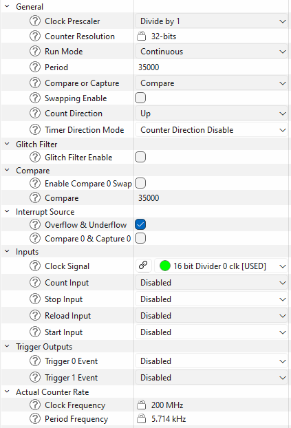

# Clock, Interrupt, Timer, and PWM Tests

This guide covers clock-frequency verification, timer-based interrupt checks, timer/counter validation, and PWM-oriented self-tests.

## Interrupt test

The interrupt self-test verifies that a timer-driven interrupt source can trigger and be observed by the
corresponding interrupt-service path. Use it to confirm that the NVIC routing, interrupt enable, and
terminal-count event of a dedicated timer are working end to end.

Configure the interrupt source in the Device Configurator:

- Add a dedicated TCPWM counter reserved for this self-test and give it the alias `CYBSP_TIMER_INTR_TEST`.
- Set the mode to `Timer - Counter` with continuous run and prescaler divide-by-1.
- Enable the terminal count interrupt. Depending on the device family and configurator version, this
  appears as `TC` or `Overflow and Underflow`.
- Drive the counter from a fixed peripheral or high-frequency clock.

The application must register `SelfTest_Interrupt_ISR_TIMER()` as the counter's terminal-count interrupt
handler. `SelfTest_Interrupt()` runs the counter for a fixed measurement window of `INTERRUPT_TEST_TIME`
(1000 us) and counts how many times that ISR fires during the window. It then compares that count against a
fixed pass window, `NUMBER_OF_TIMER_TICKS_LO` to `NUMBER_OF_TIMER_TICKS_HI`, defined per CPU IP family in
`stl/intr/SelfTest_Interrupt.h`.

Because both the 1000 us window and the pass count are fixed inside the library, you must size the counter so
that it reaches terminal count roughly `NUMBER_OF_TIMER_TICKS_LO` to `NUMBER_OF_TIMER_TICKS_HI` times during
that window. Unlike the counter/timer test, the interrupt test does not program the period internally: it uses
the `Period` value you set in the Device Configurator (`CYBSP_TIMER_INTR_TEST_config`). Configure it as follows:

- Choose a target interrupt count near the middle of the header pass window (for example, about 12 counts for
  the `9`/`15` range, or about 24 counts for the `22`/`27` range).
- Size the counter period so it overflows that many times in 1000 us. In other words, set the terminal-count
  period to approximately `1000 us / target_count`, expressed in counter input-clock cycles.
- Match the timer configuration to the selected header pass window. For PSOC™ 4 devices,
  `stl/intr/SelfTest_Interrupt.h` uses the `9`/`15` pass window. For PSOC™ 6, PSOC™ Control C3, XMC7000, and XMC5000 devices, it uses the `22`/`27`
  pass window. Configure the counter period for the actual counter input clock in your project so the counter
  still produces about 22 to 27 overflows during the fixed 1000 us measurement window.

The test returns `OK_STATUS` when the observed count falls inside the header pass window and `ERROR_STATUS`
otherwise. If a correctly wired interrupt path still fails, the counter period or input clock is almost always
the cause: recompute the period from the 1000 us window and the header count range above.

The following is an example of a self-test on the timer interrupt path:

```c
/* Configure the interrupt for the dedicated TCPWM counter (configured in
 * Device Configurator as CYBSP_TIMER_INTR_TEST). The counter interrupt must
 * be routed to the STL handler SelfTest_Interrupt_ISR_TIMER. */
cy_stc_sysint_t intrCfg =
{
    .intrSrc      = CYBSP_TIMER_INTR_TEST_IRQ,
    .intrPriority = 3UL
};

Cy_TCPWM_Counter_Init(CYBSP_TIMER_INTR_TEST_HW, CYBSP_TIMER_INTR_TEST_NUM,
                      &CYBSP_TIMER_INTR_TEST_config);
Cy_SysInt_Init(&intrCfg, &SelfTest_Interrupt_ISR_TIMER);

__enable_irq();
NVIC_ClearPendingIRQ(intrCfg.intrSrc);
Cy_TCPWM_ClearInterrupt(CYBSP_TIMER_INTR_TEST_HW, CYBSP_TIMER_INTR_TEST_NUM,
                        CY_TCPWM_INT_ON_TC);
NVIC_EnableIRQ(intrCfg.intrSrc);

/* Enable the timer and its terminal-count interrupt */
Cy_TCPWM_Counter_Enable(CYBSP_TIMER_INTR_TEST_HW, CYBSP_TIMER_INTR_TEST_NUM);
Cy_TCPWM_SetInterruptMask(CYBSP_TIMER_INTR_TEST_HW, CYBSP_TIMER_INTR_TEST_NUM,
                          CY_TCPWM_INT_ON_TC);

/* Verify the timer interrupt fired the expected number of times */
uint8_t status = SelfTest_Interrupt(CYBSP_TIMER_INTR_TEST_HW, CYBSP_TIMER_INTR_TEST_NUM);
if (OK_STATUS != status)
{
    /* Handle interrupt self-test failure */
}

/* Release the interrupt and counter after the test */
NVIC_DisableIRQ((IRQn_Type)CYBSP_TIMER_INTR_TEST_IRQ);
Cy_TCPWM_Counter_Disable(CYBSP_TIMER_INTR_TEST_HW, CYBSP_TIMER_INTR_TEST_NUM);
```

## Clock test

The clock test verifies system clock frequency by comparing two independent clocks:

- Tested clock (high-frequency): TCPWM timer driven by the system or peripheral clock, such as an HF clock derived from PLL or IMO
- Reference clock (low-frequency): WDT counter driven by ILO or WCO

The clocks must be independent. If the WCO is available, use it as the reference clock for better accuracy compared to the ILO. The test measures how many WDT ticks occur during a fixed TCPWM period of 1000 us to detect whether the system clock is running too fast or too slow.

Configure the TCPWM timer in the Device Configurator with the appropriate clock source and frequency settings:



These screenshot values are specific to one PSOC™ Control C3 M6 configuration. Do not copy the `35000` values blindly to your project. The portable configuration rule is:

- Use a dedicated TCPWM counter for the clock self-test.
- Set TCPWM mode to `Timer - Counter` with continuous run, up-counting, and prescaler divide-by-1.
- Enable the terminal count interrupt. Depending on the device family and configurator version, this appears as `TC` or `Overflow and Underflow`.
- Drive that TCPWM counter from a fixed high-frequency clock that is independent from the WDT reference clock.
- Size the timer for a 1000 us measurement window.

Base the configuration on the clock path that actually feeds the selected TCPWM counter in your project:

- determine the real timer input frequency from the chosen peripheral or HF clock source
- compute `Period` and `Compare0` from that frequency using the 1000 us rule above
- on PSOC™ Control C3 devices, make sure `STL_CLOCK_SOURCE_HFCLOCK` matches the HF clock index driving the timer

To confirm the formula, a few worked examples:

- 35 MHz timer clock -> `Period = 35000`, `Compare0 = 35000`
- 48 MHz timer clock -> `Period = 48000`, `Compare0 = 48000`
- 350 MHz timer clock -> `Period = 350000`, `Compare0 = 350000`
- 32.768 MHz timer clock -> `Period = 32768`, `Compare0 = 32768`

Always start from the actual input frequency of the TCPWM counter in your project. Do not match these numbers to a device name — the same device family can run at a different frequency depending on your clock configuration.

For PSOC™ Control C3 devices, you can override `STL_CLOCK_SOURCE_HFCLOCK` in the project's root Makefile, for example:

```mk
DEFINES+=STL_CLOCK_SOURCE_HFCLOCK=0u
```

The test returns `PASS_COMPLETE_STATUS` when measurement is complete.

The following is an example of a self-test on the Clock block:

```c
/* Initialize WDT as reference clock */
Cy_WDT_Unlock();
Cy_WDT_SetIgnoreBits(IGNORE_BITS_CLK_TEST);  /* Use all 16 bits */
Cy_WDT_ClearInterrupt();
Cy_WDT_Enable();
Cy_WDT_Lock();

/* Initialize TCPWM timer (configured in Device Configurator as CYBSP_CLOCK_TEST_TIMER)
 * driven by system/peripheral clock */
Cy_TCPWM_Counter_Init(CYBSP_CLOCK_TEST_TIMER_HW, CYBSP_CLOCK_TEST_TIMER_NUM,
                      &CYBSP_CLOCK_TEST_TIMER_config);
Cy_TCPWM_Counter_SetCounter(CYBSP_CLOCK_TEST_TIMER_HW, CYBSP_CLOCK_TEST_TIMER_NUM, 0u);

/* Initialize interrupt for TCPWM */
cy_stc_sysint_t intrCfg =
{
    .intrSrc      = CYBSP_CLOCK_TEST_TIMER_IRQ,
    .intrPriority = 3UL
};
Cy_SysInt_Init(&intrCfg, SelfTest_Clock_ISR_TIMER);
NVIC_EnableIRQ(intrCfg.intrSrc);

/* Enable timer and interrupt */
Cy_TCPWM_Counter_Enable(CYBSP_CLOCK_TEST_TIMER_HW, CYBSP_CLOCK_TEST_TIMER_NUM);
Cy_TCPWM_SetInterruptMask(CYBSP_CLOCK_TEST_TIMER_HW, CYBSP_CLOCK_TEST_TIMER_NUM, CY_TCPWM_INT_ON_TC);

/* Call periodically; result is final only when PASS_COMPLETE_STATUS is returned */
uint8_t status = SelfTest_Clock(CYBSP_CLOCK_TEST_TIMER_HW, CYBSP_CLOCK_TEST_TIMER_NUM);
if ((PASS_COMPLETE_STATUS != status) && (PASS_STILL_TESTING_STATUS != status))
{
    /* Handle clock frequency test failure */
}
```

## Counter/timer test

The counter/timer self-test validates a dedicated TCPWM timer/counter instance by confirming that its
count advances by the expected number of clock cycles within a fixed measurement window. Use it to detect
a stalled, mis-clocked, or non-incrementing timer block.

Configure the counter in the Device Configurator:

- Add a dedicated TCPWM counter reserved for this self-test and give it the alias `CYBSP_TIMER_COUNTER_TEST`.
- Set the mode to `Timer - Counter` with continuous run, up-counting, and prescaler divide-by-1.
- Enable the counter interrupt so its interrupt signal and IRQ are generated. The self-test uses the compare
  (CC) event; `SelfTest_Timer_Counter_init()` installs the handler and sets the interrupt mask to
  `CY_TCPWM_INT_ON_CC` itself, so you only need the interrupt to be routed, not a specific event preselected.
- Drive the counter from a fixed peripheral or high-frequency clock (see the minimum-frequency rule below).

The self-test programs the counter period, compare, and count values internally, so the `Period` and
`Compare` you set in the configurator are overwritten and do not affect the result. The fixed values live in
`stl/timer_counter/SelfTest_Timer_Counter.h`: `TIMER_COUNTER_TEST_PERIOD` (65535) and
`TIMER_COUNTER_TEST_COMPARE` (50000). `SelfTest_Counter_Timer()` starts the counter, waits for the compare
interrupt, and checks that the captured count lands inside the fixed pass window
`TIMER_COUNTER_COUNT_LOW`/`TIMER_COUNTER_COUNT_HIGH` (48800 to 51200).

The one configurator setting that does affect the result is the counter input-clock frequency. The counter
must reach the compare value (50000) before the fixed `TIMER_COUNTER_TIMEOUT` (2500 us) elapses, otherwise the
test times out and returns `ERROR_STATUS` even on a healthy timer. That sets a minimum input clock of about
`TIMER_COUNTER_TEST_COMPARE / TIMER_COUNTER_TIMEOUT` = 50000 counts / 2500 µs = 20 counts/µs = 20 MHz. Drive the counter from a
clock at or above that frequency. If a correctly wired counter still fails, a too-slow input clock is the most
likely cause.

The test returns `OK_STATUS` when the captured count falls inside the pass window and `ERROR_STATUS`
otherwise (including the timeout case).

The following is an example of a self-test on the timer/counter block:

```c
/* Initialize the dedicated timer/counter test instance (configured in Device
 * Configurator as CYBSP_TIMER_COUNTER_TEST) and route its terminal-count
 * interrupt to the self-test ISR. The test programs the counter period and
 * compare values internally. */
SelfTest_Timer_Counter_init(CYBSP_TIMER_COUNTER_TEST_HW,
                            CYBSP_TIMER_COUNTER_TEST_NUM,
                            &CYBSP_TIMER_COUNTER_TEST_config,
                            (IRQn_Type)CYBSP_TIMER_COUNTER_TEST_IRQ);

/* Verify the counter is incrementing within the expected window */
uint8_t status = SelfTest_Counter_Timer();
if (OK_STATUS != status)
{
    /* Handle timer/counter self-test failure */
}

/* Release the interrupt and counter after the test */
NVIC_DisableIRQ((IRQn_Type)CYBSP_TIMER_COUNTER_TEST_IRQ);
Cy_TCPWM_Counter_Disable(CYBSP_TIMER_COUNTER_TEST_HW, CYBSP_TIMER_COUNTER_TEST_NUM);
```

## PWM test

The PWM self-test validates that a PWM output actually produces the duty cycle it is programmed to. The
library drives a dedicated PWM at a fixed 33% duty cycle with a 1000 us period (`PWM_TIME`), samples the
output level in a polling loop across about five periods, and passes when the measured off-to-on time ratio is
near 2:1. Use it to detect a PWM block that is stuck, mis-clocked, or generating the wrong duty cycle.

Configure the PWM in the Device Configurator:

- Add a dedicated TCPWM in PWM mode reserved for this self-test and give it the alias `CYBSP_PWM`.
- Its interrupt must be available (`SelfTest_PWM_init()` installs the terminal-count ISR and enables the IRQ
  itself, so you only need the interrupt routed).
- Drive the PWM counter from a fixed high-frequency clock (see the clock-source rule below).

The self-test overwrites the period and compare values internally, so the `Period` and `Compare` you set in
the configurator do not affect the result. It computes the period at run time from the live counter clock
frequency and the `clockPrescaler` in `CYBSP_PWM_config`, then sets a 33% duty cycle. The measurement
thresholds live in `stl/pwm/SelfTest_PWM.h` (`PWM_TIME` = 1000 us, `PWM_TIME_TIMEOUT` = 10000 us) and in
`stl/pwm/SelfTest_PWM.c` (the pass window is an off-to-on ratio between 1.875 and 2.125, that is, the ~2:1
ratio of a 33% duty cycle). The test returns `OK_STATUS` when the measured ratio falls inside that window and
`ERROR_STATUS` otherwise.

Because the library derives the period from the clock, the one setting that affects the result is the clock
feeding the counter. On PSOC™ Control C3 the period is computed from the high-frequency clock whose index is
`STL_PWM_SOURCE_HFCLOCK` (default 3). Drive the `CYBSP_PWM` counter from that HF clock, or override the macro
in the project's root Makefile to match the HF clock that actually drives it, for example:

```mk
DEFINES+=STL_PWM_SOURCE_HFCLOCK=0u
```

How the output is sampled differs by device family, which changes whether you need to wire a pin:

- **PSOC™ Control C3, XMC7000, and XMC5000** (TCPWM v2 and later): the test reads the PWM
  line-out status register directly, so the pin arguments to `SelfTest_PWM()` are ignored and no external pin
  wiring is required. The example still passes the generated `PWM_IN_PIN` alias so the same code compiles on
  devices that need it.
- **PSOC™ 4** (M0S8 TCPWM): the test reads a physical GPIO with `Cy_GPIO_Read()`, so you must pass the port
  and pin that carry the PWM output, and that pin must be routed to the PWM line in the configurator.

If a correctly configured PWM still fails on PSOC™ Control C3, the most likely cause is
`STL_PWM_SOURCE_HFCLOCK` not matching the HF clock that drives the counter: the period is then computed from
the wrong frequency and the sampled ratio falls outside the pass window. On PSOC™ 4, a failure most often
means the pin argument does not point at the pin carrying the PWM output.

The following is an example of a self-test on the PWM block:

```c
/* Initialize the dedicated PWM instance (configured in Device Configurator as
 * CYBSP_PWM). SelfTest_PWM_init configures the PWM, installs the self-test ISR
 * on the terminal-count event, enables the interrupt, and stores the context. */
uint8_t status = SelfTest_PWM_init(CYBSP_PWM_HW, CYBSP_PWM_NUM,
                                   &CYBSP_PWM_config, (IRQn_Type)CYBSP_PWM_IRQ);
if (PWM_INIT_ERROR_STATUS != status)
{
    /* Run the duty-cycle self-test. On PSOC Control C3 the pin arguments are
     * ignored because the test samples the PWM line-out status register; they
     * are still passed for portability with devices that read a GPIO. */
    status = SelfTest_PWM(PWM_IN_PIN_PORT, PWM_IN_PIN_NUM);
    if (OK_STATUS != status)
    {
        /* Handle PWM self-test failure */
    }
}

/* Release the PWM peripheral and its interrupt after the test */
SelfTest_PWM_DeInit((IRQn_Type)CYBSP_PWM_IRQ);
```

## PWM GateKill test

The PWM GateKill self-test confirms that a PWM counter has actually stopped after its kill (fault) input was
asserted. On motor-control and power-conversion designs the kill signal must shut the PWM drivers down
quickly; this test gives you a software check that the kill took effect on the counter.

How the test decides pass/fail (`SelfTest_PWM_GateKill()` in `stl/pwm_gatekill/SelfTest_PWM_GateKill.c`): it
reads the TCPWM counter, waits 10 ms, then reads it again. If the two reads are equal, the counter is not
advancing and the test returns `OK_STATUS`; if they differ, the counter is still running and it returns
`ERROR_STATUS`. There are no configurable thresholds and no timeout macro; the only fixed value is the 10 ms
delay between the two reads, hardcoded in that source file.

This makes the outcome depend entirely on the state you put the PWM in before the call, so the two-phase
behavior matters. Because of this, `SelfTest_PWM_GateKill()` requires the kill to already be asserted when it
is called; it does not assert the kill for you. The example demonstrates both phases so the check is
self-verifying:

- With the PWM running (kill not asserted), the two reads differ and the test returns `ERROR_STATUS`.
- After the kill is asserted so the counter halts, the two reads match and the test returns `OK_STATUS`.

Configure the PWM in the Device Configurator:

- Add a dedicated TCPWM in PWM mode reserved for this self-test and give it the alias `CYBSP_PWM_GATEKILL`.
- Enable **stop on kill** so an asserted kill halts the counter (parameter `pwmstoponkill`). Without it, the
  counter keeps running after the kill and the test reports `ERROR_STATUS`.
- Choose the kill source. To exercise a hardware kill line, route one of the `Kill0Input`/`Kill1Input` inputs
  from a pin and assert that pin before the test. The example instead asserts the kill in software with
  `Cy_TCPWM_TriggerStopOrKill_Single()`, which needs no external wiring.

This test only verifies that the counter stopped between the two reads. It does not confirm the physical
output pin reached its safe state; that functional pin-level verification is out of scope for this self-test.
If a healthy design still fails after the kill is asserted, the most likely cause is **stop on kill** not
being enabled, or the kill source not actually being asserted before the call.

The following is an example of a self-test on the PWM gate-kill path:

```c
/* Initialize and enable the dedicated gate-kill PWM instance (configured in
* Device Configurator as CYBSP_PWM_GATEKILL with "stop on kill" enabled). */
Cy_TCPWM_PWM_Init(CYBSP_PWM_GATEKILL_HW, CYBSP_PWM_GATEKILL_NUM,
                  &CYBSP_PWM_GATEKILL_config);
Cy_TCPWM_PWM_Enable(CYBSP_PWM_GATEKILL_HW, CYBSP_PWM_GATEKILL_NUM);

/* Phase 1: with the PWM running (kill not asserted) the counter keeps
 * advancing, so the gate-kill test is expected to report ERROR_STATUS. */
Cy_TCPWM_TriggerReloadOrIndex_Single(CYBSP_PWM_GATEKILL_HW, CYBSP_PWM_GATEKILL_NUM);
uint8_t status = SelfTest_PWM_GateKill(CYBSP_PWM_GATEKILL_HW, CYBSP_PWM_GATEKILL_NUM);
if (ERROR_STATUS != status)
{
    /* Unexpected: the counter should still be running before the kill */
}

/* Phase 2: assert the kill in software so the counter stops; the gate-kill
 * test is now expected to report OK_STATUS. */
Cy_TCPWM_TriggerStopOrKill_Single(CYBSP_PWM_GATEKILL_HW, CYBSP_PWM_GATEKILL_NUM);
status = SelfTest_PWM_GateKill(CYBSP_PWM_GATEKILL_HW, CYBSP_PWM_GATEKILL_NUM);
if (OK_STATUS != status)
{
    /* Handle PWM gate-kill self-test failure */
}

/* Release the PWM after the test */
Cy_TCPWM_PWM_Disable(CYBSP_PWM_GATEKILL_HW, CYBSP_PWM_GATEKILL_NUM);
```
